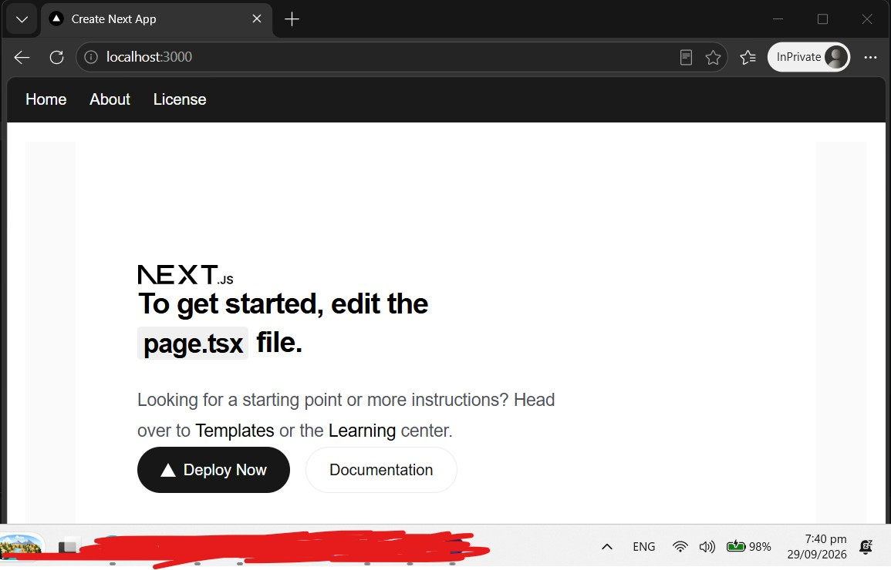
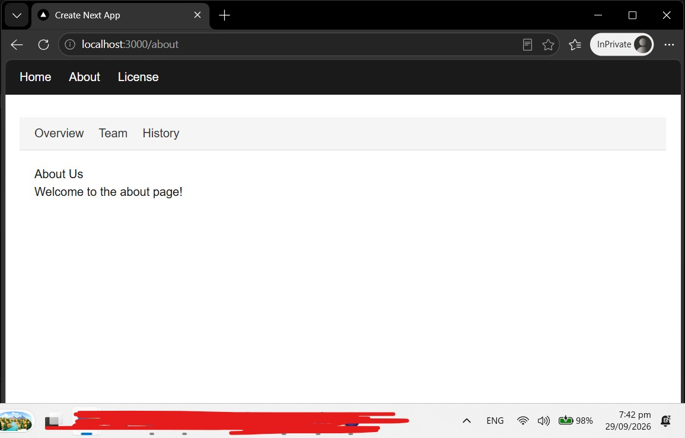
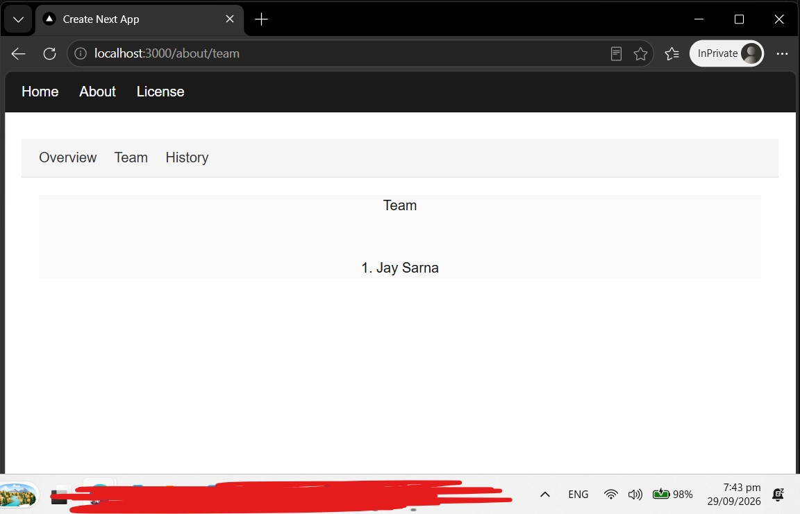
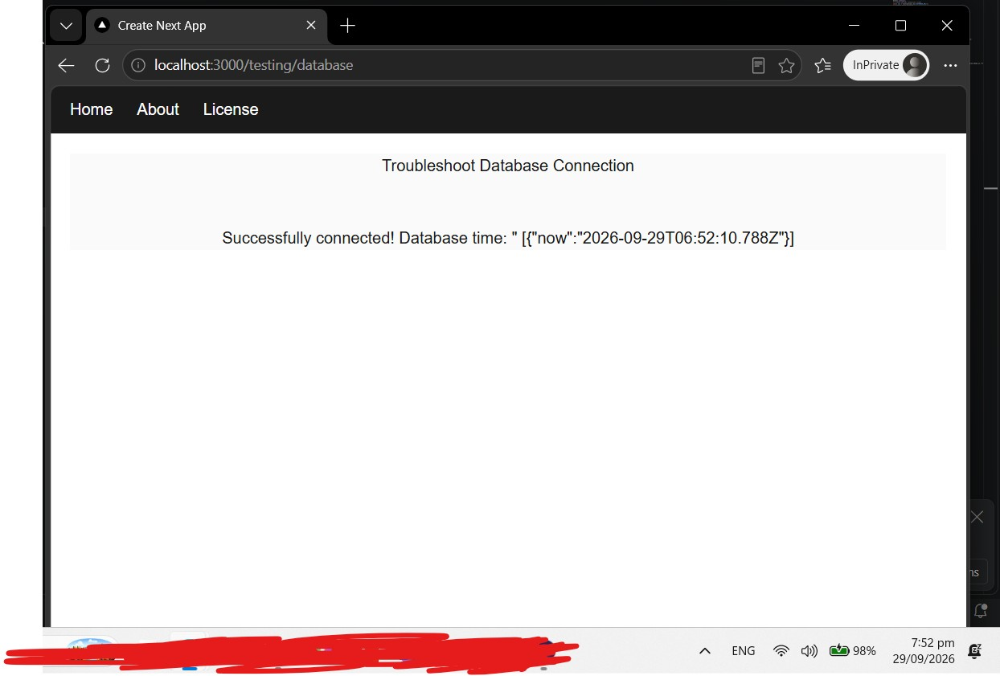
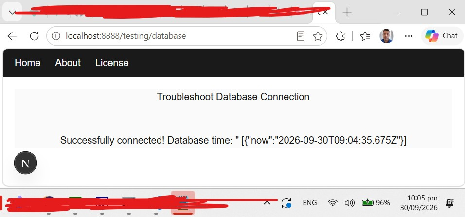
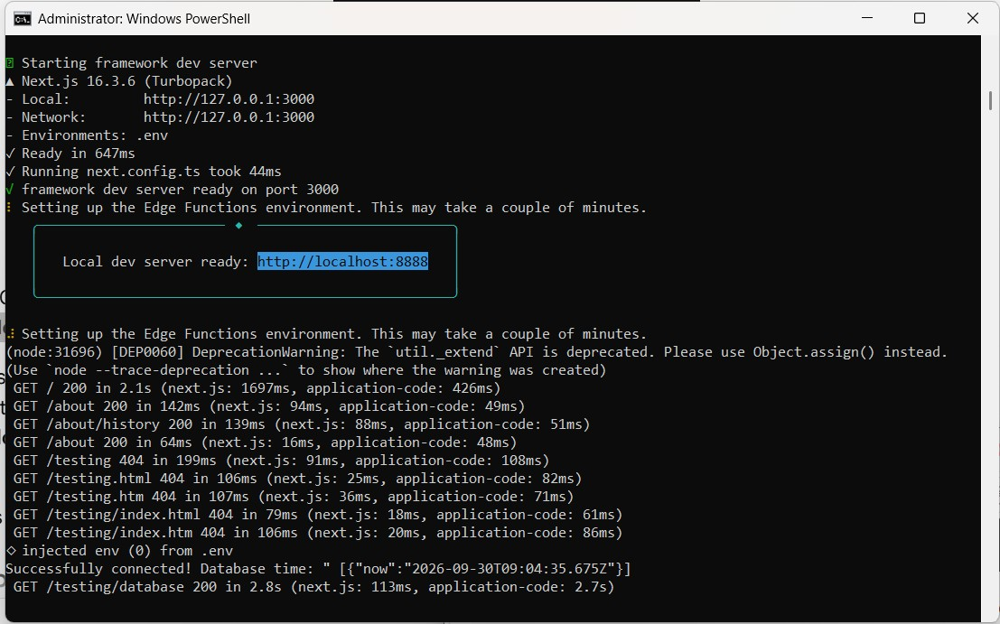
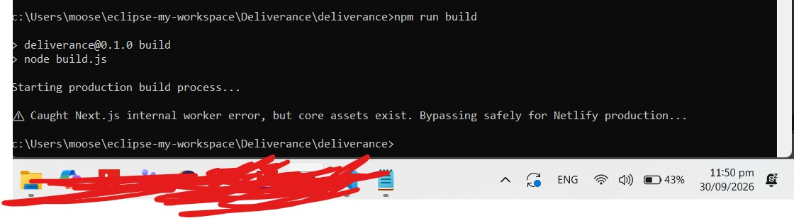
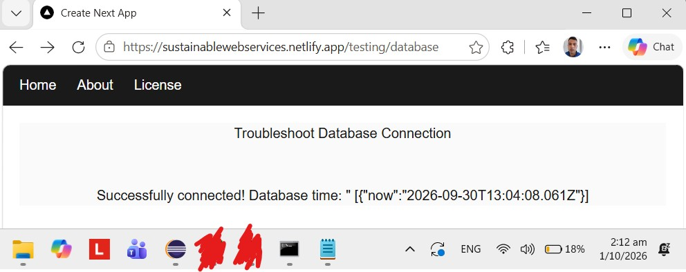

<p align="justify">
  <em style="color: red;">
    DISCLAIMER: The Developers wish to acknowledge that Artificial Intelligence is at best an ethical 'grey area', while 'Agentic AI' is 'Unethical'.
  </em>
</p>

<p align="justify">
  <em style="color: red;">
 Hence, in accordance with my IEEE membership's Code of Ethics, all development for Production Environment has occured with zero utilisation of "Agentic AI workers". Purchase my 2025 <a href="https://www.blog.systematicdefence.tech">'Future of IT for next ten years'</a> research grade article  (Submitted to IEEE) for details.
  </em>
</p>


## About  

Detail Starter Technical Documentation can be found in folder:

```bash
./cookbook/DynamicReconfigStartup.md
./cookbook/FirstNextJsProject.md
./cookbook/NeonManuallySetupPrismaDB.md
./cookbook/NextJs-FirstUiPageWithDb.md
./cookbook/NextJs-FirstNavBar.md
./cookbook/NextJs-NetlifyDeployment.md
```

See Annex A for 'Getting Started' documentation.

## Versions 

### Version 0.01 Initate Project
28 September 2026 18:09- First creation.


This is a [Next.js](https://nextjs.org) project bootstrapped with [`create-next-app`](https://nextjs.org/docs/app/api-reference/cli/create-fnext-app).

### Version 1.00 Starter template
29 September 2026 20:00- First page created with operational DB connection and menus operational:

a.  Top Menu



b. Sub Menu for about



c. Sub Menu in use



d. DB operational



### Version 2.00 Starter template with Netlify deployment

30 September 2026 : Deployment operational locally and in Prod, via Netlify

a. Local

i. UI


ii. cmd



b. Prod test locally

Proves that the build passes, and the error is plainly due to build workers, which are a recent addition in the compiler, i.e. not present in Prod.



c. Prod

https://sustainablewebservices.netlify.app/




#### Version 2.01 Polish

30 September 2026 : App Name updated in layout.tsx (global), and added a license.md. Disclaimer Added to README.md top, in hotfix.


## Annextures 

### Annex A: Getting Started

First, run the development server:

```bash
npm run dev
# or
yarn dev
# or
pnpm dev
# or
bun dev
```

Open [http://localhost:3000](http://localhost:3000) with your browser to see the result.

You can start editing the page by modifying `app/page.tsx`. The page auto-updates as you edit the file.

This project uses [`next/font`](https://nextjs.org/docs/app/building-your-application/optimizing/fonts) to automatically optimize and load [Geist](https://vercel.com/font), a new font family for Vercel.

## Learn More

To learn more about Next.js, take a look at the following resources:

- [Next.js Documentation](https://nextjs.org/docs) - learn about Next.js features and API.
- [Learn Next.js](https://nextjs.org/learn) - an interactive Next.js tutorial.

You can check out [the Next.js GitHub repository](https://github.com/vercel/next.js) - your feedback and contributions are welcome!

## Deploy on Vercel

The easiest way to deploy your Next.js app is to use the [Vercel Platform](https://vercel.com/new?utm_medium=default-template&filter=next.js&utm_source=create-next-app&utm_campaign=create-next-app-readme) from the creators of Next.js.

Check out our [Next.js deployment documentation](https://nextjs.org/docs/app/building-your-application/deploying) for more details.
